# Database Schema (Phase 2)

This document outlines the core PostgreSQL database schema for the IPO Research Assistant.

## Entity Relationship Diagram

```mermaid
erDiagram
    ipos {
        bigint id PK
        varchar name
        varchar exchange_type "MAINBOARD or SME"
        varchar sector
        numeric price_band_low
        numeric price_band_high
        date open_date
        date close_date
        date listing_date
        varchar status "UPCOMING, OPEN, LISTED"
        text source_url
    }
    
    financials {
        bigint id PK
        bigint ipo_id FK
        integer year
        numeric revenue
        numeric pat
        numeric ebitda
        numeric total_assets
        numeric total_debt
        numeric equity
    }
    
    valuation {
        bigint id PK
        bigint ipo_id FK
        numeric issue_price
        numeric market_cap
        numeric pe_ratio
        numeric pb_ratio
        numeric ev_ebitda
    }

    peer_companies {
        bigint id PK
        bigint ipo_id FK
        varchar name
        varchar ticker
        numeric pe
        numeric pb
        numeric ev_ebitda
        numeric roe
        numeric market_cap
    }

    subscription_data {
        bigint id PK
        bigint ipo_id FK
        varchar category
        numeric times_subscribed
        timestamp recorded_at
    }

    gmp_history {
        bigint id PK
        bigint ipo_id FK
        numeric gmp_amount
        numeric premium_percent
        timestamp recorded_at
    }

    documents {
        bigint id PK
        bigint ipo_id FK
        varchar type "DRHP, RHP"
        text file_path
        timestamp downloaded_at
        timestamp parsed_at
    }

    ai_analysis {
        bigint id PK
        bigint ipo_id FK
        text business_model
        text moat
        text promoter_risk
        text key_risks
        jsonb raw_json
    }

    scores {
        bigint id PK
        bigint ipo_id FK
        numeric financials_score
        text financials_reason
        numeric final_score
        varchar recommendation "SUBSCRIBE, NEUTRAL, AVOID"
        timestamp scored_at
    }

    ipo_outcomes {
        bigint id PK
        bigint ipo_id FK
        numeric issue_price
        numeric listing_price
        numeric listing_return_pct
        numeric one_year_return_pct
        numeric our_score_at_listing
    }

    reports {
        bigint id PK
        bigint ipo_id FK
        text file_path
        varchar format
        timestamp generated_at
    }

    ipos ||--o{ financials : "has many (yearly)"
    ipos ||--o| valuation : "has one"
    ipos ||--o{ peer_companies : "has many"
    ipos ||--o{ subscription_data : "has many (time-series)"
    ipos ||--o{ gmp_history : "has many (time-series)"
    ipos ||--o{ documents : "has many"
    ipos ||--o| ai_analysis : "has one"
    ipos ||--o| scores : "has one"
    ipos ||--o| ipo_outcomes : "has one"
    ipos ||--o{ reports : "has many"
```

## Description
- **`ipos`** is the central anchor table. All other tables link back to it via `ipo_id` (FOREIGN KEY with `ON DELETE CASCADE`).
- **Explainability:** The `scores` table contains `_reason` fields to persist the "why" behind every numerical score given by the AI engine.
- **Time-Series:** `subscription_data` and `gmp_history` append rows continually to track momentum leading up to listing day.
- **Feedback Loop:** `ipo_outcomes` stores post-listing reality so the system can run automated backtests against historical `scores`.
